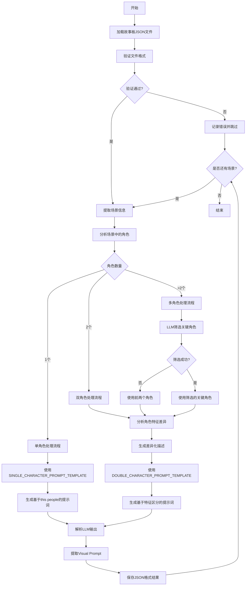
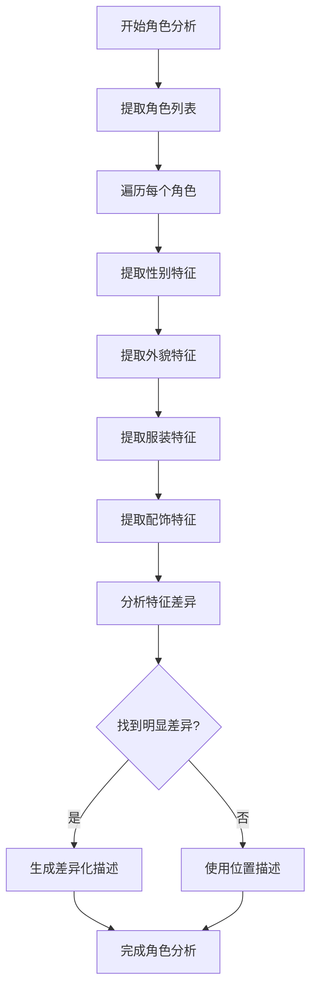

# 故事板到提示词转换功能设计文档

## 0. 技术栈

- **核心框架**：LangChain v1.0.0,参考: docs\langchain_v1_complete_tutorial.md
- **语言模型**：参考：config\llm_config.py
- **日志系统**：src\utils\logging_manager.py

## 1. 功能概述

本功能将已有的故事板JSON文件转换为适用于图像生成的英文场景提示词，通过LLM生成详细的视觉描述，以便于AI图像生成工具（如ComfyUI）能够根据故事板内容创建相应的漫画场景图像。功能支持批量处理和单文件处理，具备完整的错误处理和进度跟踪机制。


## 2. 输入数据结构

### 2.1 故事板JSON文件结构

故事板JSON文件位于`data/storyboards/`目录下，文件命名格式为`第X章 [章节标题]_storyboards.json`。

每个JSON文件包含以下主要部分：

```json
{
  "chapter_info": {
    "chapter_title": "第一章 遇强则强",
    "chapter_file": "data\\cleaned_novel\\第一章 遇强则强.txt",
    "novel_type": "玄幻",
    "processing_time": "39.6秒",
    "total_segments": 10,
    "total_scenes": 20,
    "total_storyboards": 20
  },
  "scenes": [
    {
      "scene_id": "scene_001",
      "scene_description": "主角叶君临穿越后首次意识到自身处境，面对湖面倒影震惊愤怒。",
      "environment": "玄天宗湖边，环境描述",
      "atmosphere": "氛围描述",
      "time": "时间描述",
      "characters": [
        {
          "name": "叶君临",
          "appearance": "银发青年，俊朗特征",
          "expression": "震惊和愤怒",
          "action": "凝视湖面倒影",
          "emotion": "震惊、愤怒"
        }
      ],
      "main_action": "主要动作描述",
      "emotional_tone": "情感基调",
      "visual_narrative": {
        "visual_description": "视觉描述",
        "composition": {
          "shot_type": "特写",
          "angle": "微俯",
          "layout": "构图描述",
          "focus": "焦点描述"
        },
        "environment": {
          "background": "背景描述",
          "atmosphere": "氛围描述",
          "lighting": "光线描述",
          "color_scheme": "色彩方案"
        },
        "style": {
          "art_style": "漫画风格",
          "quality_tags": ["8K高清", "超细节"],
          "additional_details": "额外细节"
        }
      }
    }
  ]
}
```

## 3. 输出数据结构

### 3.1 提示词JSON文件结构

转换后的提示词将保存为JSON文件，位于`data/storyboards_prompt/`目录下，文件命名格式为`第X章 [章节标题]_prompts.json`。

```json
{
  "chapter_info": {
    "chapter_title": "第一章 遇强则强",
    "chapter_file": "data\\cleaned_novel\\第一章 遇强则强.txt",
    "novel_type": "玄幻",
    "processing_time": "39.6秒",
    "total_segments": 10,
    "total_scenes": 20,
    "total_storyboards": 20
  },
  "scenes": [
    {
      "scene_id": "scene_001",
      "scene_index": 1,
      "scene_description": "主角叶君临穿越后首次意识到自身处境，面对湖面倒影震惊愤怒。",
      "english_prompt": "Extreme close-up shot from a slightly low-angle view, capturing the protagonist Ye Junlin's face and upper torso centered in the frame..."
    },
    {
      "scene_id": "scene_002",
      "scene_index": 2,
      "scene_description": "主角回忆穿越前的日常，并通过记忆了解当前世界与自身身份。",
      "english_prompt": "Close-up shot of Ye Junlin, a silver-haired young man with sharp,俊朗 features, standing at the center of a dreamlike lakefront consciousness realm..."
    }
  ]
}
```

## 4. 功能架构

### 4.1 核心组件

1. **StoryboardToPromptProcessor** (`storyboard_to_prompt_processor.py`)
   - 主处理类，负责协调整个转换流程
   - 提供批量处理和单文件处理接口
   - 包含处理统计、进度跟踪、文件验证等功能

2. **FileManager** (`file_manager.py`)
   - 负责文件读写操作和目录管理
   - 处理章节文件排序、备份创建、清理等
   - 支持JSON格式的场景提示词保存

3. **PromptGenerator** (`prompt_generator.py`)
   - 负责根据场景信息生成英文提示词
   - 使用LangChain和LLM进行提示词生成
   - 解析LLM输出，提取视觉提示词部分

4. **Main Entry** (`main.py`)
   - 命令行接口，提供完整的CLI功能
   - 支持批量处理、单文件处理、验证、报告导出等

### 4.2 数据流程

```
故事板JSON文件 → 文件验证 → 场景提取 → 角色分析 → 分支处理 → LLM提示词生成 → 英文提示词解析 → JSON格式保存
```

### 4.3 新逻辑工作流



### 4.4 角色特征分析工作流



### 4.3 实际处理逻辑

1. **文件加载与验证**：验证故事板JSON文件格式，确保包含必要的scenes字段
2. **场景处理**：直接处理scenes数组，为每个场景生成英文提示词
3. **LLM调用**：使用配置的LLM服务生成详细的视觉描述
4. **结果解析**：从LLM输出中解析出Visual Prompt部分
5. **JSON保存**：将场景信息和英文提示词保存为JSON文件

## 5. 提示词生成策略

### 5.1 基于角色数量的智能提示词生成

系统根据场景中涉及的角色数量，采用不同的提示词生成策略，确保角色一致性和交互准确性。

#### 5.1.1 单角色场景提示词生成

**适用场景**：场景中仅涉及一个角色

**处理逻辑**：
- 使用"this people"等通用描述指代角色，避免使用具体姓名
- 专注于单个角色的表情、动作和情感表达
- 详细描述角色与环境的互动

**提示词模板**：
```
SINGLE_CHARACTER_PROMPT_TEMPLATE = """
你是一个专业的单角色场景提示词生成专家，擅长生成适合单个角色参考图的文生图提示词。

任务：基于以下单个角色场景信息，生成高质量的视觉提示词。

背景信息：
- 小说类型：{novel_type}

故事板信息：
{scene_info}

特殊要求：
1. 使用"this people"或"this character"指代角色，不要使用具体姓名
2. 重点描述角色的外观、表情、动作和情感
3. 详细描述角色与环境的互动关系
4. 确保提示词适合配合单张角色参考图使用

输出格式：
Visual Prompt:
[详细的视觉描述，使用"this people"指代角色，包含构图、角色外观、表情、动作、环境背景、光线色彩等]
"""
```

#### 5.1.2 双角色场景提示词生成

**适用场景**：场景中涉及两个角色

**处理逻辑**：
- 使用LLM分析两个角色的特征差异，生成区分性描述
- 基于性别、外貌特征、服装颜色等差异化特征进行角色指代
- 生成适合双角色参考图的交互描述

**提示词模板**：
```
DOUBLE_CHARACTER_PROMPT_TEMPLATE = """
你是一个专业的双角色场景提示词生成专家，擅长生成适合两个角色参考图的文生图提示词。

任务：基于以下双角色场景信息，生成高质量的视觉提示词，确保两个角色能够被准确区分。

背景信息：
- 小说类型：{novel_type}

故事板信息：
{scene_info}

角色特征分析：
{character_analysis}

特殊要求：
1. 分析两个角色的差异化特征（性别、外貌、服装、配饰等）
2. 使用差异化特征进行角色指代，如"this man"、"this woman"、"this character with red clothes"等
3. 重点描述两个角色之间的交互和情感交流
4. 确保提示词适合配合两张角色参考图使用

输出格式：
Character Differentiation:
[角色差异化分析，明确两个角色的区分特征]

Visual Prompt:
[详细的视觉描述，使用差异化特征指代角色，包含构图、角色交互、表情、动作、环境背景等]
"""
```

#### 5.1.3 多角色场景提示词生成

**适用场景**：场景中涉及超过两个角色

**处理逻辑**：
- 使用LLM分析所有角色的重要性，筛选出最关键的两个角色
- 基于场景重要性、角色活跃度、情感表达等维度进行筛选
- 应用双角色场景的提示词生成逻辑

**提示词模板**：
```
MULTIPLE_CHARACTER_PROMPT_TEMPLATE = """
你是一个专业的多角色场景提示词生成专家，擅长从多个角色中筛选关键角色并生成适合的文生图提示词。

任务：基于以下多角色场景信息，筛选出最重要的两个角色并生成高质量的视觉提示词。

背景信息：
- 小说类型：{novel_type}

故事板信息：
{scene_info}

所有角色信息：
{all_characters}

角色筛选要求：
1. 基于场景重要性、角色活跃度、情感表达等维度分析所有角色
2. 筛选出对场景最关键的两个角色
3. 分析这两个角色的差异化特征

提示词生成要求：
1. 使用差异化特征进行角色指代
2. 重点描述两个关键角色之间的交互
3. 确保提示词适合配合两张角色参考图使用

输出格式：
Character Selection:
[角色筛选结果，说明选择这两个角色的理由]

Character Differentiation:
[两个关键角色的差异化特征分析]

Visual Prompt:
[详细的视觉描述，使用差异化特征指代角色，包含构图、角色交互、表情、动作等]
"""
```

### 5.2 角色特征分析模块

#### 5.2.1 特征提取逻辑

系统会自动提取以下角色特征用于区分：
- **性别特征**：male/female/other
- **外貌特征**：发色、体型、特殊标记等
- **服装特征**：颜色、款式、材质等
- **配饰特征**：武器、饰品、特殊物品等
- **位置特征**：在场景中的相对位置

#### 5.2.2 差异化描述生成

基于提取的特征，系统会生成以下类型的差异化描述：
- **基于性别的描述**："this man"、"this woman"
- **基于颜色的描述**："this character with red clothes"、"this character with blue armor"
- **基于特征的描述**："this character with silver hair"、"this character with scar on face"
- **基于位置的描述**："this character on the left"、"this character in the foreground"

### 5.3 LLM驱动的提示词生成

使用LangChain框架和配置的LLM服务进行智能提示词生成，通过结构化的提示词模板确保输出质量。

### 5.4 输出解析规则

1. **角色区分信息提取**：从LLM输出中提取角色差异化分析部分
2. **Visual Prompt提取**：提取Visual Prompt部分作为主要提示词
3. **英文内容过滤**：自动识别和提取英文内容，过滤中文部分
4. **格式清理**：去除多余格式标记，保留纯净的提示词文本

### 5.5 提示词特点

生成的英文提示词具有以下特点：
- **角色一致性**：通过参考图和差异化描述确保角色一致性
- **交互准确性**：准确描述角色之间的交互和情感交流
- **详细的视觉描述**：包含构图、视角、角色外观、表情、动作等
- **环境氛围营造**：详细描述背景、光线、色彩方案
- **艺术风格指导**：适合漫画风格的艺术建议
- **情感表达**：强调场景的情感基调和氛围

## 6. 实现细节

### 6.1 目录结构

```
src/
├── services/
│   └── storyboard_to_prompt/
│       ├── __init__.py
│       ├── config.yaml
│       ├── main.py                     # CLI入口脚本
│       ├── storyboard_to_prompt_processor.py  # 主处理器
│       ├── prompt_generator.py         # 提示词生成器
│       ├── file_manager.py             # 文件管理器
│       └── config/
│           ├── __init__.py
│           └── prompts.py              # LLM提示词模板
├── utils/
│   ├── text_processing/
│   │   └── chapter_sorter.py          # 章节排序工具
│   └── logging_manager.py             # 日志管理
└── config/
    └── llm_config.py                  # LLM配置
```

### 6.2 实际文件结构

当前模块的实际文件组织：
- **主处理器**：`storyboard_to_prompt_processor.py` - 包含完整的处理逻辑
- **文件管理器**：`file_manager.py` - 处理文件操作、备份、排序等
- **提示词生成器**：`prompt_generator.py` - 使用LLM生成英文提示词
- **角色数据管理器**：`character_data_manager.py` - 管理角色CSV数据
- **参考图片管理器**：`reference_image_manager.py` - 管理角色参考图片
- **CLI入口**：`main.py` - 提供完整的命令行接口
- **配置文件**：`config.yaml` - 配置输入输出路径

### 6.3 关键方法与功能

#### 6.3.1 StoryboardToPromptProcessor 核心方法

1. **process_all_chapters(optimize_batch=True)**
   - 批量处理所有章节的故事板文件
   - 返回详细的处理统计信息
   - 支持错误处理和进度跟踪

2. **process_chapter(file_path)**
   - 处理单个章节的故事板文件
   - 直接处理scenes数组而非segments
   - 生成JSON格式的场景提示词文件

3. **validate_storyboard_file(file_path)**
   - 验证故事板文件格式
   - 检查必要的scenes字段
   - 返回验证结果和错误信息

4. **get_chapter_list()**
   - 获取所有章节的详细信息
   - 包含文件状态、错误信息、统计数据

#### 6.3.2 FileManager 核心方法

1. **save_scene_prompts_json(chapter_info, scenes, output_path)**
   - 保存场景提示词到JSON文件
   - 每个场景包含场景信息和英文提示词

2. **get_storyboard_files()**
   - 获取所有故事板文件并按章节排序
   - 使用ChapterSorter进行文件排序

3. **create_backup(file_path)** 和 **clean_old_backups(keep_count)**
   - 提供文件备份和清理功能

#### 6.3.3 PromptGenerator 核心方法

1. **generate_prompt(scene, reference_images=None)**
   - 根据场景信息和参考图片生成英文提示词
   - 根据角色数量选择合适的提示词生成策略
   - 使用LLM和结构化提示词模板
   - 解析输出并提取Visual Prompt部分
   - 集成角色数据信息，确保角色一致性

#### 6.3.4 CharacterDataManager 核心方法

1. **load_characters_data(csv_path)**
   - 加载角色CSV数据文件
   - 解析角色信息并建立索引
   - 缓存数据以提高查询性能

2. **get_character_by_name(name)**
   - 根据角色名称查找角色信息
   - 支持主名称和别名查找
   - 返回完整的角色数据结构

3. **get_character_reference_info(character_name)**
   - 获取角色的参考图片信息
   - 包括图片路径、容貌提示词等
   - 验证参考图片的存在性

#### 6.3.5 ReferenceImageManager 核心方法

1. **validate_reference_image(image_path)**
   - 验证参考图片的存在和格式
   - 检查图片分辨率要求
   - 返回验证结果和错误信息

2. **get_character_images(character_name)**
   - 获取指定角色的所有参考图片
   - 支持多种图片格式
   - 返回图片路径列表

2. **_analyze_characters(scene)**
   - 分析场景中的角色数量和特征
   - 返回角色分析结果，用于选择提示词生成策略

3. **_generate_single_character_prompt(scene)**
   - 生成单角色场景的提示词
   - 使用"this people"等通用描述指代角色

4. **_generate_double_character_prompt(scene)**
   - 生成双角色场景的提示词
   - 分析角色特征差异，生成区分性描述

5. **_generate_multiple_character_prompt(scene)**
   - 生成多角色场景的提示词
   - 使用LLM筛选关键角色，然后应用双角色生成逻辑

6. **_extract_character_features(characters)**
   - 提取角色特征用于差异化描述
   - 分析性别、外貌、服装、配饰等特征

7. **_parse_character_differentiation(result)**
   - 解析LLM输出的角色差异化分析
   - 提取角色区分特征和指代方式

### 6.4 配置参数

#### 6.4.1 config.yaml 实际配置

```yaml
# 故事板到提示词转换配置
storyboard_to_prompt:
  # 输入输出路径配置
  paths:
    # 故事板JSON文件所在目录
    storyboard_dir: "data/storyboards"
    # 提示词JSON文件输出目录
    output_dir: "data/storyboards_prompt"
```

#### 6.4.2 LLM配置

使用项目统一的LLM配置（`config/llm_config.py`）：
- 支持本地和云端LLM服务
- 可配置超时时间、重试次数、温度参数等
- 提示词生成器使用中等温度（0.5）平衡创造性和一致性
- 角色特征分析使用较低温度（0.3）确保分析准确性
- 多角色筛选使用较低温度（0.3）确保选择合理性

### 6.4.3 参考图片配置

```yaml
# 参考图片配置
reference_images:
  # 角色图片目录
  character_image_dir: "data/characters/image"
  # 支持的图片格式
  supported_formats: [".jpg", ".jpeg", ".png", ".webp"]
  # 图片质量要求
  min_resolution: [512, 512]
  # 图片命名规则
  naming_pattern: "{character_name}.jpg"
  # 角色数据CSV文件
  characters_csv: "data/characters/characters.csv"
```

### 6.4.4 角色数据集成

系统集成了完整的角色数据管理功能，从CSV文件中读取角色信息并在提示词生成过程中使用。

#### 6.4.4.1 角色数据结构

角色数据CSV文件包含以下字段：
- **姓名**：角色的主要名称
- **别名**：角色的别名列表（JSON数组格式）
- **性别**：男/女/未知
- **外貌特征**：详细的中文明细外貌描述
- **服装特点**：服装的详细描述
- **角色类型**：主角/配角/反派
- **容貌提示词**：专业的英文图像生成提示词

#### 6.4.4.2 角色数据管理器

**CharacterDataManager** (`character_data_manager.py`)
- 负责加载和解析角色CSV数据
- 提供角色信息查询接口
- 支持按姓名、别名等多种方式查找角色
- 缓存角色数据以提高性能

#### 6.4.4.3 参考图片集成

**ReferenceImageManager** (`reference_image_manager.py`)
- 管理角色参考图片的加载和验证
- 根据角色名称查找对应的参考图片
- 验证图片格式和分辨率
- 提供图片路径和基本信息

#### 6.4.4.4 增强的提示词生成

提示词生成器现在支持：
1. **角色信息注入**：将CSV中的角色外貌、服装等信息注入到提示词模板
2. **参考图片关联**：为每个角色关联对应的参考图片
3. **容貌提示词复用**：直接使用CSV中的专业英文提示词作为基础
4. **角色一致性保证**：通过结构化数据确保角色在不同场景中的一致性

#### 6.4.4.5 输出格式增强

输出的JSON文件现在包含：
```json
{
  "chapter_info": {...},
  "scenes": [
    {
      "scene_id": "scene_001",
      "scene_index": 1,
      "scene_description": "场景描述",
      "english_prompt": "生成的英文提示词",
      "characters": [
        {
          "name": "叶君临",
          "aliases": ["天命之子", "九幽剑主"],
          "gender": "男",
          "character_type": "主角",
          "reference_image_path": "data/characters/image/叶君临.jpg",
          "character_prompt": "角色专用英文提示词"
        }
      ]
    }
  ]
}
```

### 6.5 日志系统

集成项目的统一日志系统：
- 使用`src/utils/logging_manager.py`
- 模块标识：`LogModule.STORYBOARD_TO_PROMPT`
- 日志文件位于`logs/storyboard_to_prompt/`目录

## 7. 使用示例

### 7.1 命令行使用

```bash
# 处理所有章节
python -m src.services.storyboard_to_prompt.main --all

# 处理单个章节
python -m src.services.storyboard_to_prompt.main --chapter "第一章 遇强则强_storyboards.json"

# 列出所有章节
python -m src.services.storyboard_to_prompt.main --list

# 验证故事板文件
python -m src.services.storyboard_to_prompt.main --validate "第一章 遇强则强_storyboards.json"

# 清理旧备份
python -m src.services.storyboard_to_prompt.main --clean-backups --keep 5

# 导出处理报告
python -m src.services.storyboard_to_prompt.main --export-report
```

### 7.2 Python代码使用

```python
from src.services.storyboard_to_prompt.storyboard_to_prompt_processor import StoryboardToPromptProcessor

# 使用默认配置
processor = StoryboardToPromptProcessor()

# 批量处理所有章节
result = processor.process_all_chapters()
print(f"处理完成，成功: {result['successful_chapters']}, 失败: {result['failed_chapters']}, 总提示词: {result['total_prompts']}")

# 处理单个章节
from pathlib import Path
chapter_file = Path("data/storyboards/第一章 遇强则强_storyboards.json")
result = processor.process_chapter(chapter_file)
if result['success']:
    print(f"处理成功，生成 {result['prompt_count']} 个提示词")
    print(f"输出文件: {result['output_path']}")

# 获取章节列表
chapters = processor.get_chapter_list()
for chapter in chapters:
    print(f"{chapter['file_name']}: {'有效' if chapter['is_valid'] else '无效'}")

# 验证文件
is_valid, errors = processor.validate_storyboard_file(chapter_file)
if not is_valid:
    print("文件验证失败:")
    for error in errors:
        print(f"  - {error}")
```

## 8. 实际功能特性

### 8.1 已实现功能

1. **完整的CLI接口**：支持批量处理、单文件处理、验证、报告导出等
2. **文件管理功能**：自动备份、清理、排序、验证等
3. **进度跟踪**：实时处理进度、错误统计、状态报告
4. **LLM集成**：使用LangChain和配置的LLM服务生成高质量提示词
5. **JSON格式输出**：结构化的场景提示词数据，便于后续处理

### 8.2 错误处理与容错

1. **文件验证**：完整的JSON格式验证
2. **异常捕获**：详细的错误信息和日志记录
3. **备份机制**：自动创建备份，防止数据丢失
4. **断点续传**：支持处理中断后的恢复
5. **参考图片验证**：验证参考图片的存在性和格式
6. **角色特征分析失败处理**：当无法分析角色特征时使用默认描述方式
7. **多角色筛选失败处理**：当无法筛选关键角色时使用前两个角色

### 8.3 性能优化

1. **批量处理**：支持多文件并行处理
2. **内存管理**：合理的文件加载和处理策略
3. **日志优化**：分级日志记录，避免性能影响

## 9. 扩展性设计

### 9.1 提示词策略扩展

- 通过修改`config/prompts.py`中的模板支持不同的图像生成工具
- 支持自定义提示词生成逻辑和解析规则
- 支持新增角色数量处理策略（如三角色、群体场景等）
- 支持自定义角色特征提取和差异化描述逻辑

### 9.2 输出格式扩展

- FileManager已设计为支持多种输出格式
- 可轻松扩展支持TXT、CSV等格式输出

### 9.3 LLM服务扩展

- 通过配置文件支持不同的LLM服务
- 可适配本地部署和云端API服务

## 10. 注意事项

1. **依赖环境**：需要正确配置LLM服务和相关依赖
2. **文件路径**：确保输入输出目录路径正确且具有读写权限
3. **编码处理**：已正确处理中文内容的UTF-8编码
4. **资源消耗**：LLM调用会消耗计算资源和API配额
5. **日志管理**：定期清理日志文件，避免占用过多空间

## 11. 故障排除

1. **LLM连接问题**：检查`config/llm_config.py`配置和网络连接
2. **文件路径问题**：确认故事板文件存在于配置的目录中
3. **权限问题**：确保输出目录具有写入权限
4. **内存问题**：处理大量文件时注意内存使用情况
5. **备份空间**：定期清理备份文件，释放磁盘空间

## 12. 测试计划

1. **单元测试**：各组件核心功能测试
2. **集成测试**：完整转换流程测试
3. **性能测试**：大量文件处理性能测试
4. **错误测试**：异常情况处理测试
5. **角色处理测试**：
   - 单角色场景提示词生成测试
   - 双角色场景特征区分测试
   - 多角色场景筛选测试
   - 角色特征分析准确性测试
6. **参考图片集成测试**：
   - 参考图片加载和验证测试
   - 参考图片与提示词匹配测试
   - 角色一致性验证测试