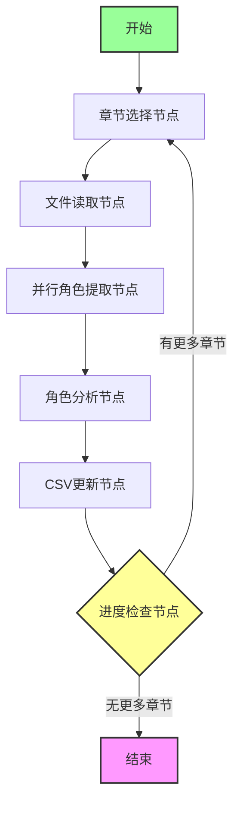
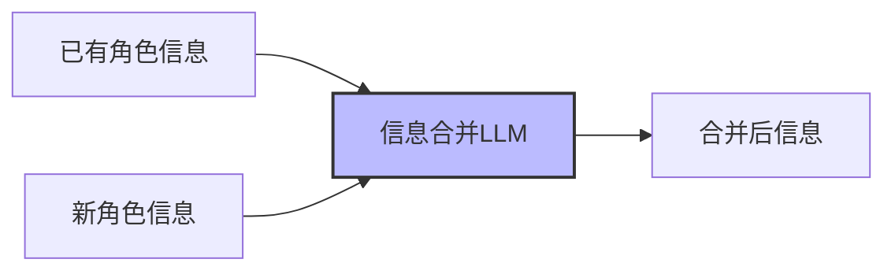
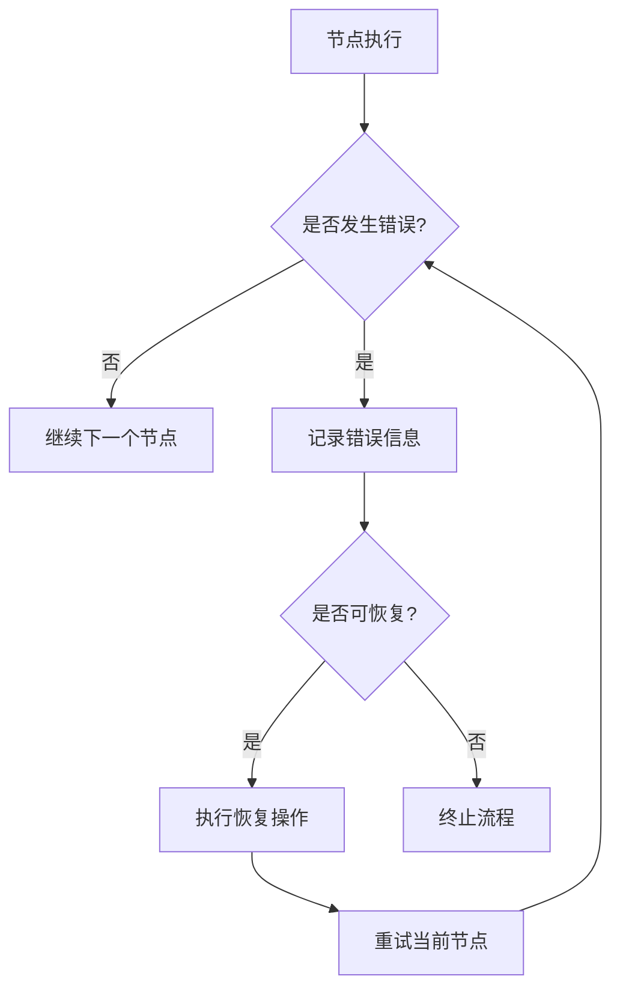
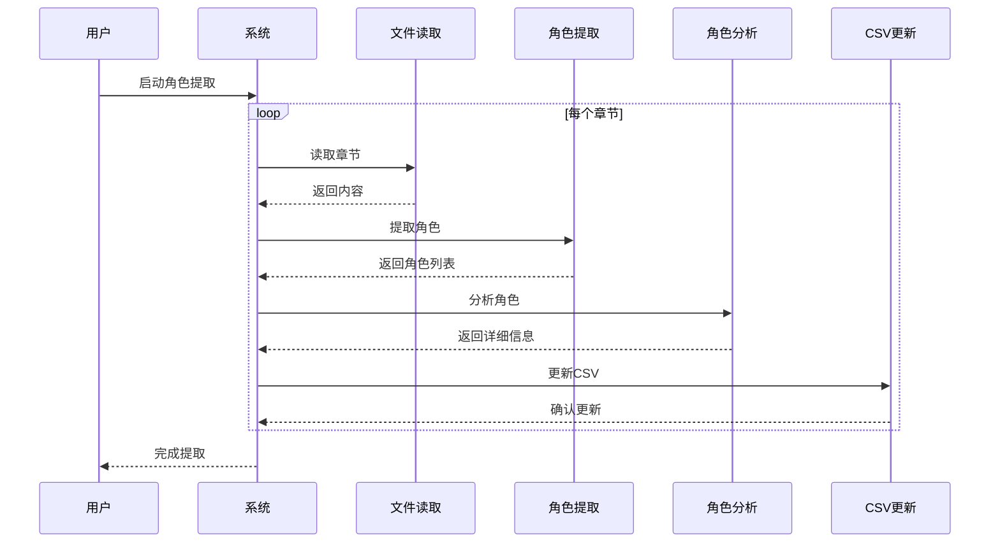

# 角色提取设计文档

## 1. 概述

本文档描述了一个基于LangGraph的工作流设计，用于从小说文本中提取角色信息，并将结果保存到CSV文件中。该工作流按章节顺序处理小说，每处理完一个章节就更新CSV文件，支持角色信息的智能合并。

## 2. 系统架构



## 3. 状态定义

```python
class CharacterExtractionState(TypedDict):
    current_chapter: str  # 当前处理的章节文件名
    chapter_content: str  # 章节内容
    extracted_characters: List[Dict]  # 当前章节提取的角色
    all_characters: Dict[str, Dict]  # 所有角色信息（以姓名为键）
    processed_chapters: List[str]  # 已处理的章节列表
    csv_path: str  # CSV文件路径
    error: Optional[str]  # 错误信息
```

## 4. 节点设计

### 4.1 章节选择节点 (ChapterSelector)

- **功能**: 获取下一个未处理的章节
- **输入**: 已处理章节列表
- **输出**: 当前章节文件名
- **流程**:
  ```mermaid
  flowchart LR
      A[获取章节列表] --> B[筛选未处理章节]
      B --> C{是否有未处理章节?}
      C -->|是| D[选择下一个章节]
      C -->|否| E[标记为完成]
      D --> F[更新状态]
  ```

### 4.2 文件读取节点 (FileReader)

- **功能**: 读取当前章节文件内容
- **输入**: 章节文件名
- **输出**: 章节内容
- **错误处理**: 文件不存在或读取失败时记录错误

### 4.3 并行角色提取节点 (ParallelCharacterExtractor)

- **功能**: 并行提取当前章节中的角色信息
- **输入**: 章节内容
- **输出**: 角色列表
- **并行处理流程**:
  ```mermaid
  graph TB
      A[章节内容] --> B[内容分割]
      B --> C[并行处理部分1]
      B --> D[并行处理部分2]
      B --> E[并行处理部分N]
      C --> F[角色提取]
      D --> G[角色提取]
      E --> H[角色提取]
      F --> I[结果合并]
      G --> I
      H --> I
      I --> J[去重与初步过滤]
  ```

### 4.4 角色分析节点 (CharacterAnalyzer)

- **功能**: 对提取的角色进行深度分析
- **输入**: 基础角色列表
- **输出**: 详细角色信息
- **分析流程**:
  ```mermaid
  flowchart TD
      A[角色列表] --> B[性别识别]
      B --> C[外貌特征提取]
      C --> D[服装特点分析]
      D --> E[角色类型判断]
      E --> F[信息整合]
  ```

### 4.5 CSV更新节点 (CSVUpdater)

- **功能**: 更新CSV文件中的角色信息
- **输入**: 新提取的角色信息
- **输出**: 更新后的CSV文件
- **更新流程**:
  ```mermaid
  flowchart TD
      A[读取现有CSV] --> B{角色是否已存在?}
      B -->|否| C[添加新角色]
      B -->|是| D[智能合并信息]
      C --> E[保存CSV]
      D --> E
  ```

### 4.6 进度检查节点 (ProgressChecker)

- **功能**: 检查是否还有未处理的章节
- **输入**: 已处理章节列表
- **输出**: 下一步操作指令

## 5. 智能角色信息合并策略

对于已存在的角色，使用专门的LLM节点进行信息合并：



### 合并提示词设计

```python
def merge_character_info(existing_info: Dict, new_info: Dict) -> Dict:
    """使用LLM智能合并角色信息，保持简洁"""
    prompt = f"""
    请合并以下两个角色信息，保持简洁且不重复：
    
    已有信息：
    - 性别: {existing_info.get('性别', '未知')}
    - 外貌特征: {existing_info.get('外貌特征', '未知')}
    - 服装特点: {existing_info.get('服装特点', '未知')}
    - 角色类型: {existing_info.get('角色类型', '未知')}
    
    新信息：
    - 性别: {new_info.get('性别', '未知')}
    - 外貌特征: {new_info.get('外貌特征', '未知')}
    - 服装特点: {new_info.get('服装特点', '未知')}
    - 角色类型: {new_info.get('角色类型', '未知')}
    
    请返回合并后的简洁信息，格式为JSON：
    {{
        "性别": "...",
        "外貌特征": "...",
        "服装特点": "...",
        "角色类型": "..."
    }}
    """
    # 调用LLM处理并返回结果
```

## 6. CSV文件格式

CSV文件包含以下列：

| 列名 | 描述 | 示例 |
|------|------|------|
| 姓名 | 角色名称 | 叶君临 |
| 性别 | 角色 性别 | 男 |
| 外貌特征 | 外观描述 | 银白色长发，黑袍，剑眉星目 |
| 服装特点 | 服装描述 | 黑色长袍 |
| 角色类型 | 角色 分类 | 主角 |

## 7. 错误处理与恢复机制



### 恢复策略

1. **章节级别恢复**: 记录已处理的章节，支持从中断点恢复
2. **节点级别重试**: 对可恢复错误实施自动重试
3. **错误日志**: 详细记录错误信息，便于调试

## 8. 性能优化

1. **并行处理**: 章节内部使用并行处理提高效率
2. **缓存机制**: 缓存已处理的章节信息
3. **批量操作**: 批量写入CSV减少I/O操作

## 9. 部署与执行

### 执行流程



## 10. 配置参数

| 参数名 | 类型 | 默认值 | 描述 |
|--------|------|--------|------|
| novel_path | str | data/cleaned_novel | 小说文件目录 |
| csv_path | str | data/characters/characters.csv | 输出CSV文件路径 |
| max_parallel_tasks | int | 4 | 最大并行任务数 |
| llm_temperature | float | 0.3 | LLM温度参数 |
| retry_count | int | 3 | 失败重试次数 |