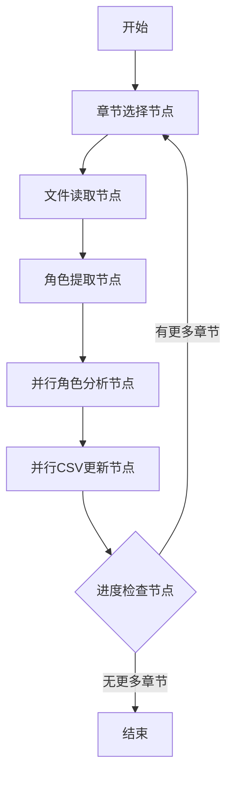
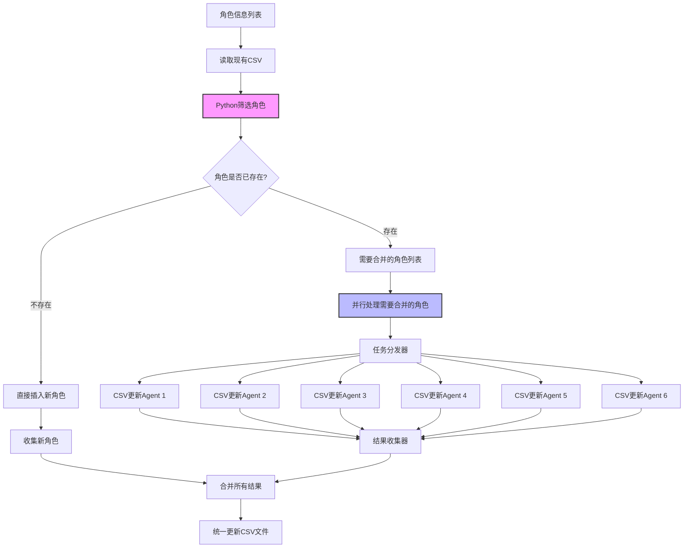
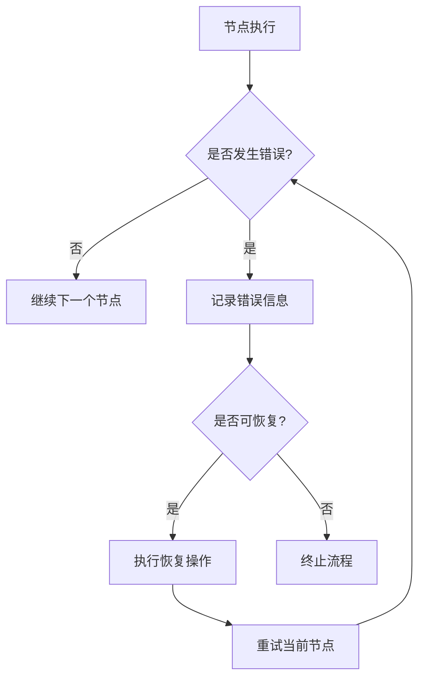
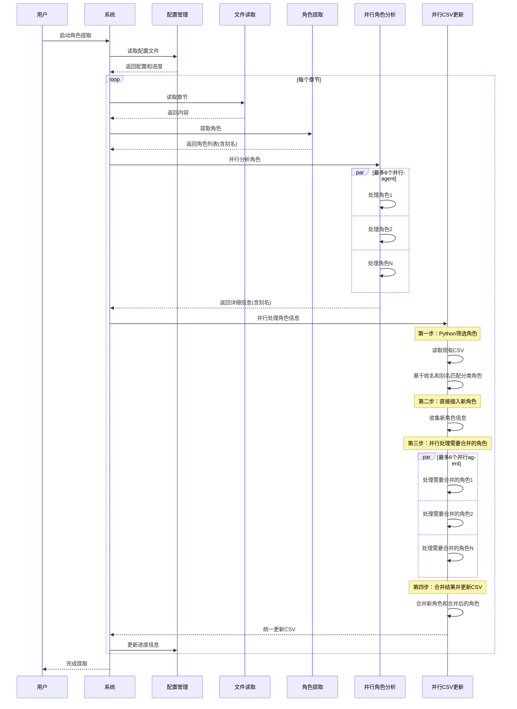

# 角色提取设计文档

## 1. 概述

本文档描述了一个基于LangGraph的工作流设计，用于从小说文本中提取角色信息，并将结果保存到CSV文件中。该工作流按章节顺序处理小说，每处理完一个章节就更新CSV文件，支持角色信息的智能合并。系统支持角色别名处理，能够识别和合并同一角色的不同称呼（如全名、昵称、称号等）。

## 2. 系统架构



## 3. 状态定义

```python
class CharacterExtractionState(TypedDict):
    current_chapter: str  # 当前处理的章节文件名
    chapter_content: str  # 章节内容
    extracted_characters: List[Dict]  # 当前章节提取的角色
    all_characters: Dict[str, Dict]  # 所有角色信息（以姓名为键）
    processed_chapters: List[str]  # 已处理的章节列表
    csv_path: str  # CSV文件路径
    error: Optional[str]  # 错误信息
    config_path: str  # 配置文件路径
    character_aliases: Dict[str, List[str]]  # 角色别名映射（主名称到别名列表）
```

## 4. 节点设计

### 4.1 章节选择节点 (ChapterSelector)

- **功能**: 获取下一个未处理的章节
- **输入**: 已处理章节列表
- **输出**: 当前章节文件名
- **流程**:
  ```mermaid
  flowchart LR
      A[获取章节列表] --> B[筛选未处理章节]
      B --> C{是否有未处理章节?}
      C -->|是| D[选择下一个章节]
      C -->|否| E[标记为完成]
      D --> F[更新状态]
  ```

### 4.2 文件读取节点 (FileReader)

- **功能**: 读取当前章节文件内容
- **输入**: 章节文件名
- **输出**: 章节内容
- **错误处理**: 文件不存在或读取失败时记录错误

### 4.3 角色提取节点 (CharacterExtractor)

- **功能**: 提取当前章节中的角色信息
- **输入**: 章节内容
- **输出**: 角色列表
- **处理流程**:
  ```mermaid
  flowchart TD
      A[章节内容] --> B[文本预处理]
      B --> C[角色名称识别]
      C --> D[角色列表输出]
  ```
- **LLM提示词**:
  ```
  你是一个专业的小说角色提取专家。请从以下章节文本中提取所有角色名称。
  
  任务要求：
  1. 识别文本中提到的所有角色名称（包括主角、配角、反派等）
  2. 忽略无明确名称的泛指角色（如"路人甲"、"众人"等）
  3. 只返回明确有姓名或称号的角色
  4. 对于每个角色，尽可能识别其可能的别名、昵称或称号
  
  输出格式：
  [
    {
      "name": "角色名称",
      "aliases": ["别名1", "别名2", ...]  // 可选，如果没有别名则为空列表
    },
    ...
  ]
  
  章节文本：
  {chapter_content}
  ```

### 4.4 并行角色分析节点 (ParallelCharacterAnalyzer)

- **功能**: 并行对提取的角色进行深度分析
- **输入**: 基础角色列表
- **输出**: 详细角色信息
- **并行处理流程**:
  ```mermaid
  graph TB
      A[角色列表] --> B[任务分发器]
      B --> C[角色分析Agent 1]
      B --> D[角色分析Agent 2]
      B --> E[角色分析Agent 3]
      B --> F[角色分析Agent 4]
      B --> G[角色分析Agent 5]
      B --> H[角色分析Agent 6]
      C --> I[结果收集器]
      D --> I
      E --> I
      F --> I
      G --> I
      H --> I
      I --> J[信息整合]
  ```
- **并行限制**: 最多同时存在6个角色分析Agent
- **任务分配**: 每个Agent负责一个角色的全面分析
- **完成条件**: 所有角色都完成分析后进入下一节点
- **角色分析Agent提示词**:
  ```
  你是一个专业的小说角色分析专家。请对以下角色进行全面分析。
  
  角色信息：
  - 姓名：{character_name}
  - 别名：{character_aliases}  // 如果有别名的话
  
  任务要求：
  1. 判断角色性别（男/女/未知）
  2. 提取外貌特征（发型、面容、身材等，50字以内）
  3. 提取服装特点（衣着风格、特殊装饰等，50字以内）
  4. 判断角色类型（主角/配角/反派/其他）
  5. 整合和补充别名信息（如果有）
  
  输出格式（JSON）：
  {
    "性别": "男/女/未知",
    "外貌特征": "外貌描述（50字以内）",
    "服装特点": "服装描述（50字以内）",
    "角色类型": "主角/配角/反派/其他",
    "别名": ["别名1", "别名2", ...]  // 如果没有别名则为空列表
  }
  
  注意：如果某项信息不明确，请填写"未知"。保持描述简洁准确。
  ```

### 4.5 并行CSV更新节点 (ParallelCSVUpdater)

- **功能**: 并行处理角色信息并更新CSV文件
- **输入**: 详细角色信息
- **输出**: 更新后的CSV文件
- **处理流程**:
  ```mermaid
  flowchart TD
      A[角色信息列表] --> B[读取现有CSV]
      B --> C[Python筛选角色]
      C --> D{角色是否已存在?}
      D -->|不存在| E[直接插入新角色]
      D -->|存在| F[需要合并的角色列表]
      E --> G[收集新角色]
      F --> H[并行处理需要合并的角色]
      H --> I[任务分发器]
      I --> J[CSV更新Agent 1]
      I --> K[CSV更新Agent 2]
      I --> L[CSV更新Agent 3]
      I --> M[CSV更新Agent 4]
      I --> N[CSV更新Agent 5]
      I --> O[CSV更新Agent 6]
      J --> P[结果收集器]
      K --> P
      L --> P
      M --> P
      N --> P
      O --> P
      G --> Q[合并所有结果]
      P --> Q
      Q --> R[统一更新CSV文件]
  ```
- **并行限制**: 最多同时存在6个CSV更新Agent
- **任务分配**: 每个Agent负责处理一个需要合并的角色信息
- **完成条件**: 所有角色处理完成后，统一更新CSV文件
- **角色筛选逻辑**:
  1. **角色分类**: 使用Python代码基于姓名和别名精确匹配将角色分为两类：
     - 新角色：CSV中不存在的角色（包括主名称和所有别名都不匹配），直接插入
     - 已存在角色：CSV中已存在的角色（主名称或任一别名匹配），需要合并处理
  2. **新角色处理**: 直接添加新角色信息到结果集
  3. **已存在角色处理**: 并行调用LLM进行智能信息合并
- **CSV更新Agent提示词**:
  ```
  你是一个专业的角色信息整合专家。请根据已有信息和新信息，合并角色数据。
  
  已有角色信息：
  {existing_character_info}
  
  新角色信息：
  {new_character_info}
  
  任务要求：
  1. 智能合并新旧信息：
     - 优先保留更详细、更准确的描述
     - 去除重复信息
     - 补充缺失信息
     - 保持描述简洁（每项不超过50字）
  2. 确保合并后的信息逻辑一致
  3. 合并别名信息，去除重复，保持唯一性
  
  输出格式（JSON）：
  {
    "姓名": "角色姓名",
    "性别": "男/女/未知",
    "外貌特征": "外貌描述（50字以内）",
    "服装特点": "服装描述（50字以内）",
    "角色类型": "主角/配角/反派/其他",
    "别名": ["别名1", "别名2", ...]  // 如果没有别名则为空列表
  }
  
  注意：如果某项信息不明确，请填写"未知"。保持描述简洁准确。
  ```

## 4.6 配置文件设计

为了支持中断恢复处理，在`src/services/extraction_character`目录下创建`config.yaml`配置文件：

```yaml
# 角色提取配置文件
extraction:
  # 当前处理进度
  progress:
    current_chapter: ""  # 当前处理的章节文件名
    processed_chapters: []  # 已处理的章节列表
    last_update_time: ""  # 最后更新时间
    
  # 文件路径配置
  paths:
    novel_path: "data/cleaned_novel"  # 小说文件目录
    csv_path: "data/characters/characters.csv"  # 输出CSV文件路径
    config_path: "src/services/extraction_character/config.yaml"  # 配置文件路径
    
  # 并行处理配置
  parallel:
    max_analyzer_agents: 6  # 角色分析最大并行agent数
    max_csv_agents: 6  # CSV更新最大并行agent数
    
  # 错误处理配置
  error_handling:
    retry_count: 3  # 失败重试次数
    log_errors: true  # 是否记录错误日志
    
  # LLM配置
  llm:
    config_path: "config/llm_config.py"  # LLM配置文件路径
    temperature: 0.4  # LLM温度参数（与llm_config.py保持一致）
    max_tokens: 2000  # 最大生成token数（与llm_config.py保持一致）
    timeout: 30  # 请求超时时间（与llm_config.py保持一致）
```

### 配置文件管理

- **初始化**: 系统启动时检查配置文件是否存在，不存在则创建默认配置
- **进度更新**: 每完成一个章节处理后更新配置文件中的进度信息
- **恢复机制**: 系统中断重启后，从配置文件读取进度，从中断点继续处理
- **配置修改**: 支持运行时修改配置参数，如并行agent数量等

### 配置文件更新频率和处理逻辑

1. **更新频率**:
   - 每完成一个章节处理后立即更新配置文件
   - 系统启动时读取配置文件获取上次处理进度
   - 配置参数修改后立即保存到配置文件

2. **更新处理逻辑**:
   ```python
   def update_config(config_path: str, current_chapter: str, processed_chapters: List[str]) -> bool:
       """
       更新配置文件中的进度信息
       """
       try:
           # 读取现有配置
           with open(config_path, 'r', encoding='utf-8') as f:
               config = yaml.safe_load(f)
           
           # 更新进度信息
           config['extraction']['progress']['current_chapter'] = current_chapter
           config['extraction']['progress']['processed_chapters'] = processed_chapters
           config['extraction']['progress']['last_update_time'] = datetime.now().isoformat()
           
           # 写入配置文件（原子操作）
           temp_path = f"{config_path}.tmp"
           with open(temp_path, 'w', encoding='utf-8') as f:
               yaml.dump(config, f, ensure_ascii=False, default_flow_style=False)
           
           # 原子性替换原文件
           os.replace(temp_path, config_path)
           
           return True
       except Exception as e:
           log_error(f"配置文件更新失败: {e}")
           return False
   ```

3. **配置文件备份机制**:
   - 每次更新配置文件前，自动创建备份
   - 备份文件命名格式：`config_backup_YYYYMMDD_HHMMSS.yaml`
   - 保留最近5个配置文件备份，自动删除更旧的备份

### 4.7 进度检查节点 (ProgressChecker)

- **功能**: 检查是否还有未处理的章节
- **输入**: 已处理章节列表
- **输出**: 下一步操作指令

## 5. 智能角色信息合并策略

对于已存在的角色，使用Python代码进行判断，然后调用LLM进行信息合并：



### 合并逻辑

1. **角色分类**: 使用Python代码基于姓名和别名精确匹配将角色分为两类：
   - 新角色：CSV中不存在的角色（包括主名称和所有别名都不匹配），直接插入
   - 已存在角色：CSV中已存在的角色（主名称或任一别名匹配），需要合并处理

2. **新角色处理**: 直接添加新角色信息到结果集，无需LLM调用

3. **已存在角色处理**: 并行调用LLM进行智能信息合并，最多6个并行Agent

### 合并提示词设计

```python
def merge_character_info(existing_info: Dict, new_info: Dict) -> Dict:
    """使用LLM智能合并角色信息，保持简洁"""
    prompt = f"""
    你是一个专业的角色信息整合专家。请根据已有信息和新信息，合并角色数据。
    
    已有角色信息：
    {existing_info}
    
    新角色信息：
    {new_info}
    
    任务要求：
    1. 智能合并新旧信息：
       - 优先保留更详细、更准确的描述
       - 去除重复信息
       - 补充缺失信息
       - 保持描述简洁（每项不超过50字）
    2. 确保合并后的信息逻辑一致
    3. 合并别名信息，去除重复，保持唯一性
    
    输出格式（JSON）：
    {{
      "姓名": "角色姓名",
      "性别": "男/女/未知",
      "外貌特征": "外貌描述（50字以内）",
      "服装特点": "服装描述（50字以内）",
      "角色类型": "主角/配角/反派/其他",
      "别名": ["别名1", "别名2", ...]  // 如果没有别名则为空列表
    }}
    
    注意：如果某项信息不明确，请填写"未知"。保持描述简洁准确。
    """
    # 调用LLM处理并返回结果
```

### LLM配置说明

所有LLM调用统一使用`config/llm_config.py`中的配置，包括：
- API基础地址和模型名称
- 请求超时时间和重试次数
- 温度参数和其他模型参数

这确保了整个系统中LLM调用的一致性，便于统一管理和调整。

## 6. CSV文件格式

CSV文件包含以下列：

| 列名 | 描述 | 示例 |
|------|------|------|
| 姓名 | 角色名称 | 叶君临 |
| 性别 | 角色 性别 | 男 |
| 外貌特征 | 外观描述 | 银白色长发，黑袍，剑眉星目 |
| 服装特点 | 服装描述 | 黑色长袍 |
| 角色类型 | 角色 分类 | 主角 |
| 别名 | 角色别名、昵称、称号 | 君临|叶公子|剑仙|

### CSV文件示例

```csv
姓名,性别,外貌特征,服装特点,角色类型,别名
张三,男,高大英俊，黑发棕眼,常穿蓝色西装，白色衬衫,主角,
李四,女,苗条美丽，长发及腰,喜欢穿红色连衣裙,配角,小丽|丽丽
王五,男,中等身材，戴着眼镜,总是穿着灰色外套,配角,老王|王老师
```

### 别名列说明

- 别名列使用竖线"|"分隔多个别名
- 如果角色没有别名，该列为空
- 别名包括昵称、称号、简称等角色的不同称呼
- 别名信息在角色合并时会被智能合并，去除重复

## 7. 错误处理与恢复机制



### 恢复策略

1. **章节级别恢复**: 记录已处理的章节，支持从中断点恢复
2. **节点级别重试**: 对可恢复错误实施自动重试
3. **错误日志**: 详细记录错误信息，便于调试
4. **别名处理错误恢复**: 当别名处理失败时，保留主名称信息，确保核心数据不丢失

## 8. 性能优化

1. **并行处理**: 角色分析和CSV更新阶段使用并行处理提高效率
   - 角色分析阶段最多6个并行agent
   - CSV更新阶段最多6个并行agent
2. **缓存机制**: 缓存已处理的章节信息和角色分析结果
3. **批量操作**: 所有角色处理完成后统一更新CSV文件，减少I/O操作
4. **配置驱动**: 通过配置文件灵活调整并行参数，适应不同硬件环境
5. **别名索引优化**: 建立别名到主名称的映射索引，加速角色匹配过程

## 9. 部署与执行

### 执行流程



## 10. 配置参数

| 参数名 | 类型 | 默认值 | 描述 |
|--------|------|--------|------|
| novel_path | str | data/cleaned_novel | 小说文件目录 |
| csv_path | str | data/characters/characters.csv | 输出CSV文件路径 |
| config_path | str | src/services/extraction_character/config.yaml | 配置文件路径 |
| max_analyzer_agents | int | 6 | 角色分析最大并行agent数 |
| max_csv_agents | int | 6 | CSV更新最大并行agent数 |
| llm_config_path | str | config/llm_config.py | LLM配置文件路径 |
| llm_temperature | float | 0.4 | LLM温度参数（与llm_config.py保持一致） |
| llm_max_tokens | int | 2000 | 最大生成token数（与llm_config.py保持一致） |
| llm_timeout | int | 30 | 请求超时时间（与llm_config.py保持一致） |
| retry_count | int | 3 | 失败重试次数 |
| log_errors | bool | true | 是否记录错误日志 |
| enable_alias_matching | bool | true | 是否启用别名匹配 |
| min_alias_similarity | float | 0.8 | 别名相似度阈值（0-1） |
| max_aliases_per_character | int | 10 | 每个角色最大别名数量 |

### LLM配置说明

所有LLM调用统一使用`config/llm_config.py`中的配置，包括：
- API基础地址和模型名称
- 请求超时时间和重试次数
- 温度参数和其他模型参数

这确保了整个系统中LLM调用的一致性，便于统一管理和调整。

## 11. 实现注意事项

1. **配置文件管理**: 
   - 确保配置文件的原子性更新，避免写入过程中断导致配置损坏
   - 定期备份配置文件，防止意外丢失

2. **并行处理限制**:
   - 角色分析和CSV更新阶段的并行agent数量应根据系统资源动态调整
   - 实现任务队列机制，确保高负载时的系统稳定性

3. **错误处理**:
   - 单个角色分析失败不应影响其他角色的处理
   - CSV更新失败时应有回滚机制，保证数据一致性

4. **性能监控**:
   - 记录各阶段的处理时间，便于性能优化
   - 监控并行agent的资源使用情况，防止系统过载

### CSV文件备份机制

确保数据安全，系统实现了简单的CSV文件备份机制：

1. **自动备份策略**:
   - 每次更新CSV文件前，自动创建备份
   - 备份文件命名格式：`characters_backup_YYYYMMDD_HHMMSS.csv`
   - 备份文件存储位置：与CSV文件相同的目录

2. **备份实现代码**:
   ```python
   import os
   import shutil
   from datetime import datetime
   
   def create_csv_backup(csv_path: str) -> str:
       """
       创建CSV文件的备份
       返回备份文件路径
       """
       try:
           # 获取当前时间戳
           timestamp = datetime.now().strftime("%Y%m%d_%H%M%S")
           
           # 构建备份文件名
           dir_name = os.path.dirname(csv_path)
           base_name = os.path.basename(csv_path)
           name, ext = os.path.splitext(base_name)
           backup_filename = f"{name}_backup_{timestamp}{ext}"
           backup_path = os.path.join(dir_name, backup_filename)
           
           # 创建备份
           shutil.copy2(csv_path, backup_path)
           
           return backup_path
       except Exception as e:
           log_error(f"CSV备份创建失败: {e}")
           return ""
   ```