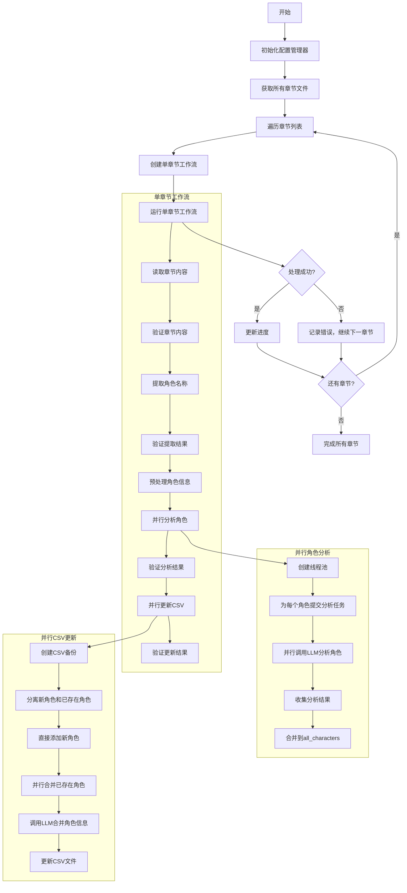

# 角色提取工作流流程图

## 整体架构

角色提取工作流采用两层架构：
1. **外部编排层**：负责遍历所有章节，管理整体进度
2. **内部处理层**：负责单个章节的角色提取、分析和更新

## Mermaid流程图

## 关键组件说明

### 1. 外部编排器 (CharacterExtractionOrchestrator)
- 负责整体流程控制
- 遍历所有章节文件
- 管理处理进度
- 调用单章节工作流

### 2. 单章节工作流 (SingleChapterWorkflow)
- 使用LangGraph构建状态图
- 线性处理流程：读取→提取→分析→更新
- 每个步骤都有验证机制

### 3. 核心节点

#### 文件读取节点 (FileReader)
- 读取章节文本内容
- 验证内容有效性

#### 角色提取节点 (CharacterExtractor)
- 使用LLM从文本中提取角色名称
- 预处理角色信息（别名处理等）

#### 并行角色分析节点 (ParallelCharacterAnalyzer)
- 使用线程池并行分析多个角色
- 为每个角色调用LLM进行详细分析
- 收集分析结果

#### 并行CSV更新节点 (ParallelCSVUpdater)
- 创建CSV备份
- 分离新角色和已存在角色
- 并行合并角色信息
- 更新CSV文件

### 4. 工具类

#### LLM工具类 (LLMUtils)
- 封装LLM调用
- 提供角色提取、分析和合并功能
- 处理配置加载和错误重试

#### CSV工具类 (CSVUtils)
- 读写CSV文件
- 查找和合并角色信息
- 验证CSV格式

#### 配置管理器 (ConfigManager)
- 加载和保存配置
- 管理处理进度
- 提供配置访问接口

## 数据流

1. **输入**：章节文本文件
2. **中间数据**：
   - 章节内容
   - 提取的角色名称列表
   - 角色详细分析结果（包含容貌提示词）
3. **输出**：包含所有角色信息和容貌提示词的CSV文件

## 错误处理

- 每个节点都有验证步骤
- 错误会被记录到状态中
- 单个章节失败不会中断整个流程
- CSV更新前会创建备份

## 并行处理

- 角色分析使用线程池并行处理
- CSV更新中的角色合并也使用并行处理
- 可配置的最大并行worker数

## 配置管理

- 使用YAML文件存储配置
- 支持运行时配置覆盖
- 进度信息持久化存储

## 容貌提示词

### 容貌提示词

**功能说明：**
- 为每个角色生成英文的容貌提示词，用于文生图工具生成角色图像
- 提示词采用动漫风格，聚焦于角色上半身脸部特写
- 提示词内容符合小说中的角色设定，可以适当发挥以增加独特性
- 格式为"anime style, upper body, close-up portrait, [详细容貌描述]"

**生成方式：**
- 在角色分析阶段，LLM会根据角色描述生成英文容貌提示词
- 在角色信息合并阶段，会智能合并多个容貌提示词，保留最详细、最生动的描述
- 提示词包含面部特征、发型、表情等细节，适合生成高质量的动漫风格图像

**示例：**
- 示例1：anime style, upper body, close-up portrait, young girl with long silver hair and blue eyes, gentle smile
- 示例2：anime style, upper body, close-up portrait, middle-aged man with short black hair, beard, serious expression
- 示例3：anime style, upper body, close-up portrait, elderly woman with white hair in a bun, wrinkles around eyes, kind smile